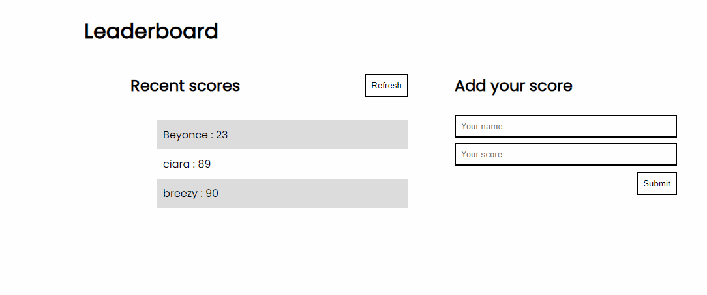

### 🔴 [Live Link](https://jmoseka.github.io/Leaderboard/)

### DEMO



# Leaderboard

The leaderboard website displays scores submitted by different players. It also allows you to submit your score

## Built With

JS

CSS

HTML

Webpack

# Getting Started

### Prerequisites

[Node](https://nodejs.org/en/download/)

### Setup
1. Git [clone]("https://github.com/jmoseka/Leaderboard") this repository to your local machine
- ```git clone https://github.com/jmoseka/To-Do-List``` 

-  ``` cd To-Do-List```

2. Download as [zip](https://github.com/jmoseka/Leaderboard.git) and extract the files to your local machine

<hr>

### Installations
```npm install #to install all modules that are listed on package.json file and their dependencies.```

(if needed)

```npm update #to update all packages in the node_modules directory and their dependencies ```

```npm run start #to open the project on browser using webpack liveserver```

<hr>

### Usage
Use [liverserver](https://marketplace.visualstudio.com/items?itemName=ritwickdey.LiveServer#:~:text=Shortcuts%20to%20Start%2FStop%20Server&text=Open%20a%20HTML%20file%20and,on%20Open%20with%20Live%20Server%20.&text=Open%20the%20Command%20Pallete%20by,Server%20to%20stop%20a%20server) to open and run the project in the browser

<hr>

### Run tests

Run tests with jest

`npm test`

Run tests on the .css files
```npx stylelint "**/*.{css,scss}"```

Run tests on the .js files
```npx eslint ```

Run ALL tests on the pull request 

<hr>

### Deployment
Files can be deployed with github pages

## Author 👤

Jamila Moseka

- GitHub: [jmoseka](https://github.com/jmoseka)
- LinkedIn [jamila-moseka](https://www.linkedin.com/in/jamila-moseka/)
- Twitter [@milamoseka](https://twitter.com/milamoseka)

<hr>

## Contributing 🤝 

Contributions, issues, and feature requests are welcome!

## Acknowledgments 🥇
All the devs who build softwares that we use to make code

## Show your support

Give a ⭐️ if you like this project!

## 📝 License

This project is [MIT](./LICENSE) licensed.